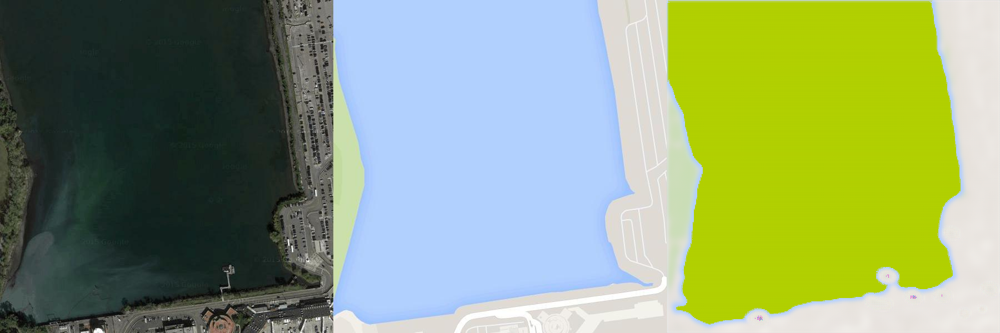

# 1、Poisson Image Editing with PyTorch

利用opencv的fillpoly函数，将多边形内填充为白色，只取单通道便可得mask

根据论文中[Posssion Image Editing](https://github.com/RuiboGao/HomeWork-of-DIP/blob/main/Assignment_2/Possion%20Image%20Editing/Poisson%20Image%20Editing.pdf)描述，在边界处实现梯度匹配实现图像编辑，
具体代码在[run_blending_gradio.py](https://github.com/RuiboGao/HomeWork-of-DIP/blob/main/Assignment_2/Possion%20Image%20Editing/run_blending_gradio.py)。
## Running
    python run_blending_gradio.py

## Results

## Reference
[泊松图像编辑入门宝典](https://buptjz.github.io/2014/03/17/poissonImageEditing)

# 2、Pix2pix

## FCN Network 
根据Res18 Ne的网络结构模型,参考[博文](https://blog.csdn.net/qq_42102546/article/details/128607586),去除最后avgpool、FC(512,1000)层，添加四层转置卷积层，具体见[FCN_network_res18.py](
./Pix2pix/FCN_network_res18.py)

## Dataset
数据集来自[网站](https://efrosgans.eecs.berkeley.edu/pix2pix/datasets/)中的maps.tar.gz

## Result
该模型训练结果示例

## Reference

[Fully Convolutional Networks for Semantic Segmentation](./Pix2pix/Fully%20Convolutional%20Networks%20for%20Semantic%20Segmentation.pdf)
